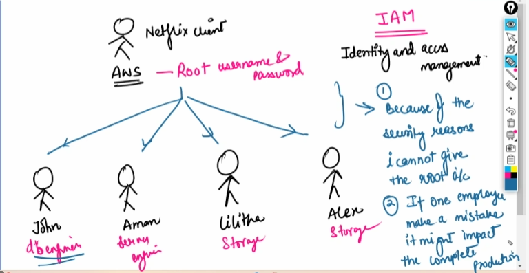

# Identity and Access Management (IAM)

To avoid the problem they will create a user 

1. Create the users and individually attach the permissions to the user 
Permission :

EC2 full access 
2. Create a group with sepcific permissions  

[Creating IAM rules](https://drive.google.com/drive/folders/1TeEjVHIvk-IJP97fGt4e0Ec-KkqXN143?usp=drive_link)