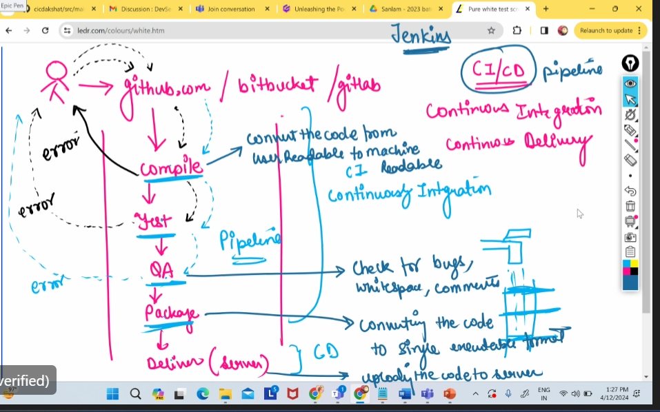
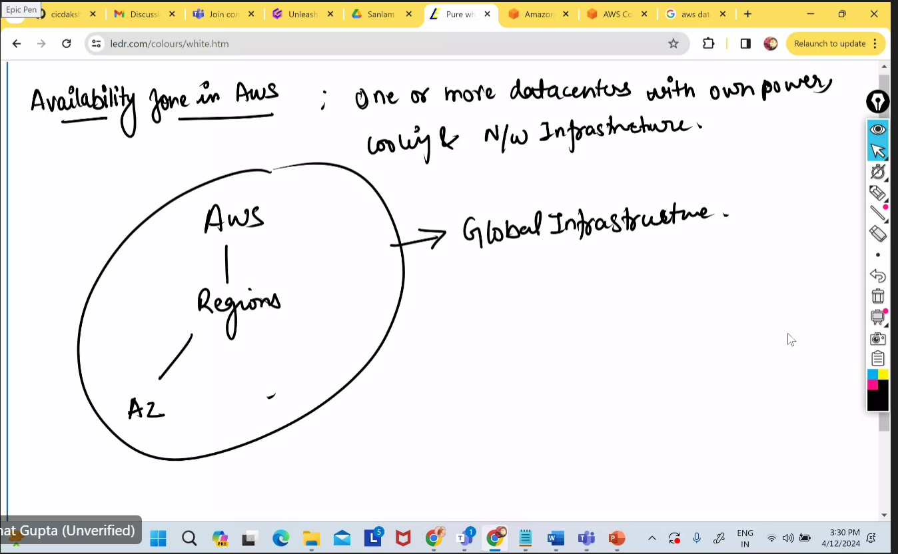

# Devops-training

Initally was waterfall

This was fixed by Agile methdolgy

## Software development cycle 
 - coinging given to 
 - Build team - compiling the code to 
 - Test team - - test the functality 
 - QA team - ensure quality of code
 - Deleviered - uploaded to server for user 

Problem was that they were unable to get to the feedback of client as we stuck by test team or build. Unable to get to the the client for review. Each team took long and then giving problems back to the user 

### The fix:
Removed the diffrent teams working at every step and replaced them with software. More streamlined in Jenkins, does all these steps. All the t 
 - Build team - maven software , gradel 
 - Test team - Appiumn, sleniumn 
 - QA team -  checkstyle
 - Deleviered - Aws, Azure, Google

 Devops - Automation of Software Development Lifecyle (SDLC) 

This improves the efficienty by 90% with tis automation.

## CI/CD Continous Integration and Continous Delivery

-  Github --> Compile --> Test --> QA--> package --> deilver (upload to server)
- if error happens at any stage - the developer can resolve the error and push the code  - Continously integreation
- it continousesy update the package and deliver - it is continouse delivery 
- This is a pipeline - goes through each item in the pipeline
- compile - convert code to machine readbly format
- QA - check for bug, whitespace, comments 
- packaging - it is converting the code to a single executable formate

# Test 
### Dynamic Application Security Testing (DAST)
- Testing an application while it is running to identity the vanerablities from external perspecive. Like a hacker  
### Static Application Secuity Testing (SAST)
- Analyse the application source code or compiled binary without executing teh code

## What is the cloud computing 
e.g. AWS (32%), AZURE(20%), GCP (8%), Oracle cloud, Alibaba cloud

Server it is a computer - it has RAM and where multiplle can access and i can handle that access - (RAM, VCPU, process, os, storage)
- you pay only when one uses the resources. (Pay as you go)
- create a account with auto scaling
- Auto Scaling - the resoures will automatically increase or descrease depending on traffic  - No up front cost / Capitical expediture  
## pysical server
- buying servers next to me (on premisis) it is Onprem servers - we buy maintain and keep (operatinal costs)

# Amazon Web Services (AWS)

- deploy our app virtually from any location via the internet
- 32 regions
- two datacenters(Avalability zones) generally two per area.
- Datacenters - it a buildingwhere server is kept. You can access them from anywhere with the internet. 

AWS --> Amazon web services is one cloud providers which provides resources on pay per use basis to deploy the app or website.

Compettitors --> Azure, GCP, Oracle cloud, Alibaba

Reegions in aws --> It is a geographical area where Aws Resources are hosted. Wach Region consists of multiple Avability Zones (AZ) which are pythically seprate data centres within close proximity to one another.

Availity Zone in AWS --> comproises of one or more data centers with on powers with own Infrastructure.

Golabal imnfrastructure: AWS --> Regions -- Avaliblty zone 

