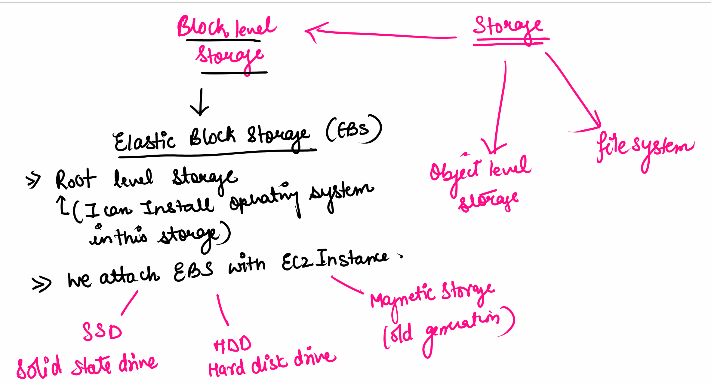
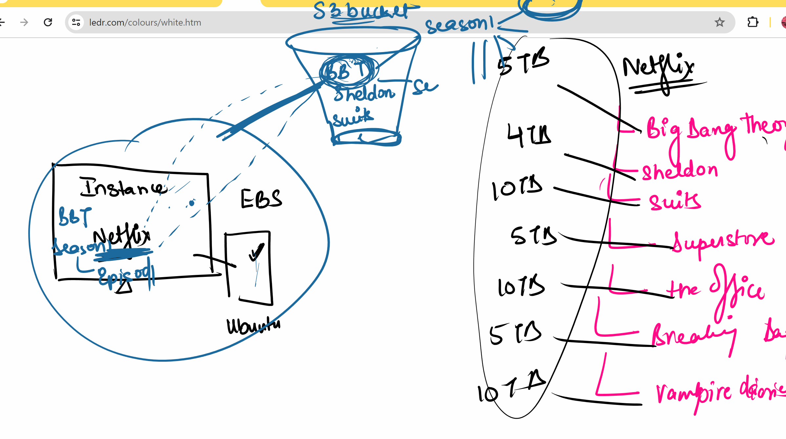
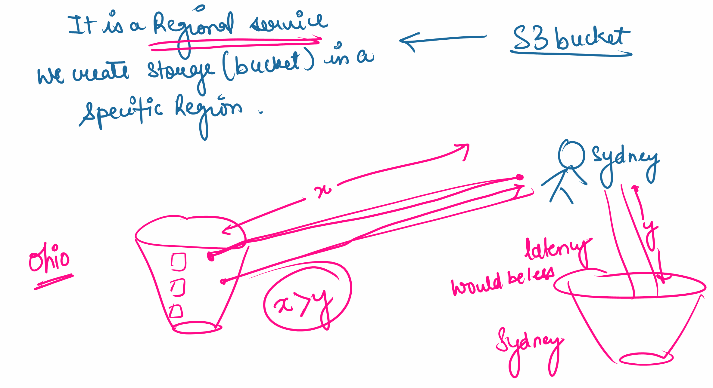
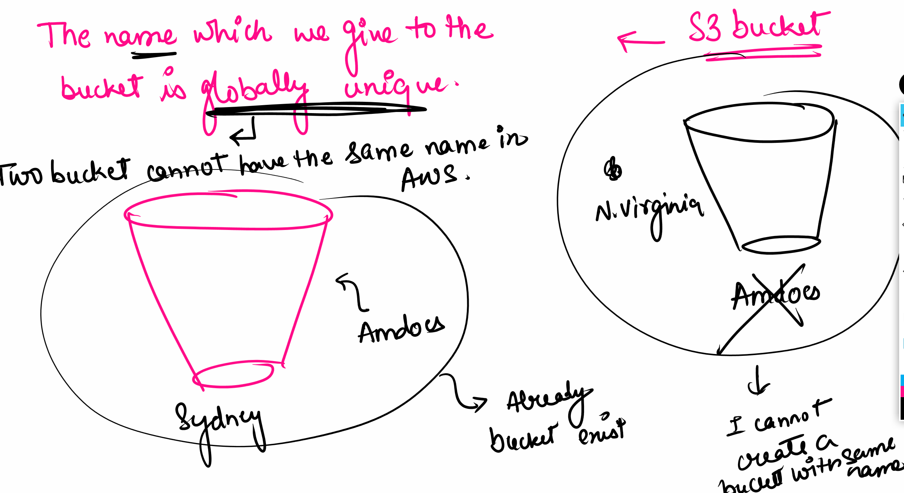
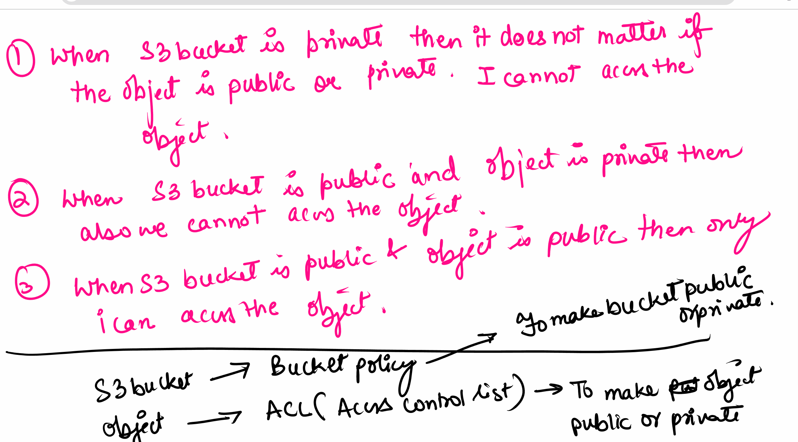
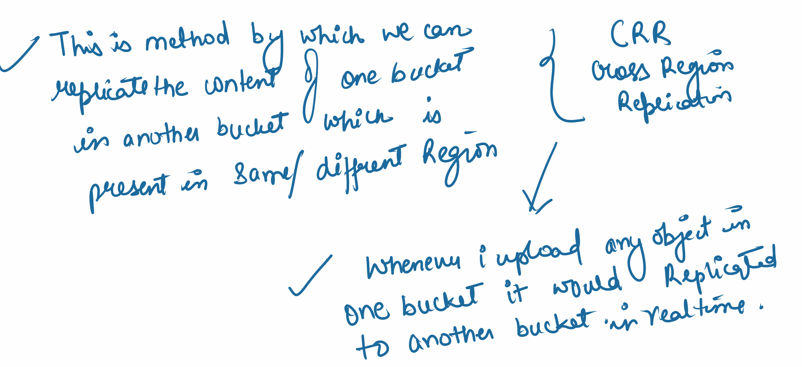

# Storage

### Types:
- Block level storage
    - elastic block storage (EBS)
    - root level storage - I can install the Operating System in this storage
    - We attach EBS with EC2 Instance 
    
- Object level storage 
- file stystem   

### EBS (Elastic block storage):
- SSD - Solid State Device  
    - chip based storage
    - Chip based storage 
    - It is the fastest
    - costly
- HDD - Hard Disk Drive
    - disk rotates at a high speed and R/W opertime happens in disk
    - Slow and very fragile
    - little less costly
- Magnetic storage
    - slowest storage
    - cheap
    - cannot use it in pre-prod or production level

### Object level storage 
- S3 storage (simple storage service)
    - Non root storage  ( cannot install any OS)
    - you can keep any numbers of object and it can also restrict the access of the object

S3 bucket:
- pay for both read and write
- Regional service - we create the storage (bucket) in a secific region.
- The ame which we give to the bucket is gloabally unique - if the name already exists cannot make same bucket

1. When S3 buckt is private then it does not matter if the object is public/private - one will be unable to access the object 
2. When the S3 Bucket is public andobject is private  - one can not access the object
3. When s3 bucket is public + object is public then one can access the object 

S3 bucket --> Bucket policy - to make bucket public/private

object --> Access control list (ACL) -> make the object private or public

ACLs It is permision given to object - recommeded to keep it private 
If a person by mistake tries 

Make ACLs - Enabled

Block all public acess - make it private

## Bucket Versioning
- keeping the objects as a version to avoid accidental deletion or override

[Creating a bucket](https://drive.google.com/file/d/1i3KSLGnnLFPoogxl9tkpiAp_F1_AObz3/view?usp=sharing)

## Versionaing 
When evere you accedentially dele or update the file then the previous version of te file is saved as version

If i delete the tab then the file is restored 
if one deltes the image and tab then it is gone forever 

## Cross Region Replication (CRR)

Problem from two regions of work there is a delay which is the problem.
You can creat a anoter bucket and in realtime connectivity that gets updated in realtime. You have a failsafe if something is deleted in one bucket

One bucket becomes source and another becomes destination

- This is a metod by which we can replicate content of one bucket in another bucket which is present in same/different region

Create a replication rule - To work with replication we need to enable versionin for source and destinaton

RTC it reduces tme to replicate the object - reuires data chages added up.

[CRR notes](https://drive.google.com/file/d/1_lHGpv_0HbmyrAkkgSuN-3nRi1LUwsZZ/view?usp=drive_link)

### S3 bucket
can host a static website on S3 Bucket
- The website which does not have any database 

Client cannot have EC2 -> due to high hourly/min/sec

Can host it on S3 it will be cheaper.

## costs
5gb is free

It cost per read and write

[Creating a RDP with windows](https://url.za.m.mimecastprotect.com/s/0vR_CVm2Xkul0NYRBcGWX4k?domain=drive.google.com)

## Dynamodb
- Collection of data items
- stores data instance 
- also has a primary key
- Structure (Schema) of dynomdb is not fixed
- one table so manage so eaier to manage

We need to give the permission to acces dynmodb via IAM(Identity Access Management) Roles 

We will give the EC2 the permission to access dynomodb on behalf

- Read Capacity unit (RCV)
    - No of data we read per min from dyanmodb
- Write capacity unit (WCU)
    - No of data we write with dynmo db    

[Create a dynamo db](https://docs.google.com/document/d/12C0auVZlRouX4_yQJRNkn2HquZBpMKQq/edit?usp=drive_link&ouid=103157204066713600014&rtpof=true&sd=true)