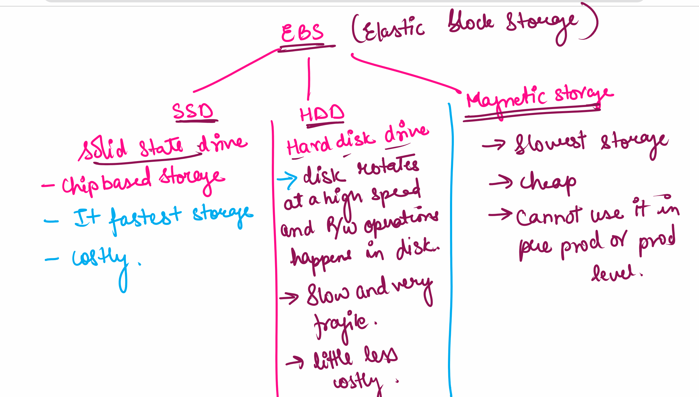

# Storage

### Types:
- Block level storage
    - elastic block storage (EBS)
    - root level storage - I can install the Operating System in this storage
    - We attach EBS with EC2 Instance 
    
- Object level storage 
- file stystem   

### EBS (Elastic block storage):
- SSD - Solid State Device  
    - chip based storage
    - Chip based storage 
    - It is the fastest
    - costly
- HDD - Hard Disk Drive
    - disk rotates at a high speed and R/W opertime happens in disk
    - Slow and very fragile
    - little less costly
- Magnetic storage
    - slowest storage
    - cheap
    - cannot use it in pre-prod or production level

### Object level storage 
- S3 storage (simple storage service)
    - Non root storage  ( cannot install any OS)
    - you can keep any numbers of object and it can also restrict the access of the object

S3 bucket:
- pay for both read and write
- Regional service - we create the storage (bucket) in a secific region.
- The ame which we give to the bucket is gloabally unique - if the name already exists cannot make same bucket

1. When S3 buckt is private then it does not matter if the object is public/private - one will be unable to access the object 
2. When the S3 Bucket is public andobject is private  - one can not access the object
3. When s3 bucket is public + object is public then one can access the object 

S3 bucket --> Bucket policy - to make bucket public/private
object --> Access control list -> make the object private or public

