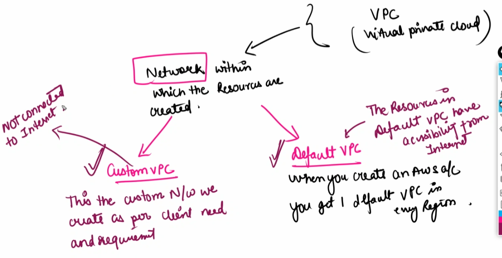
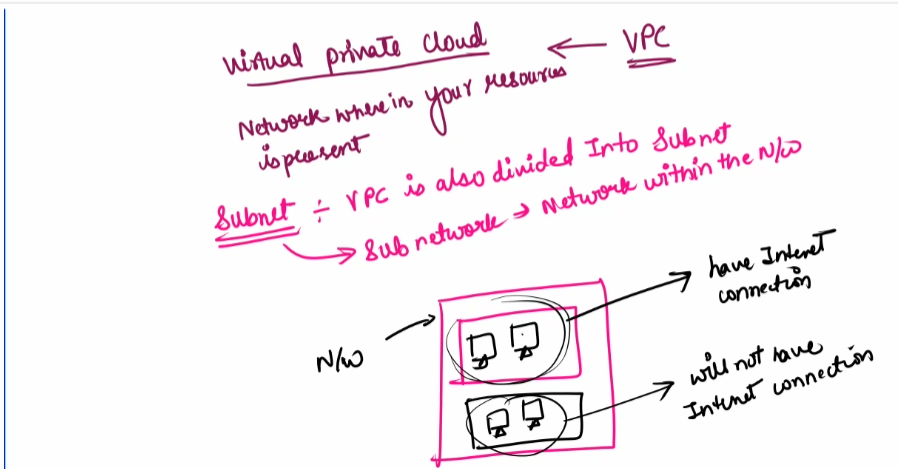
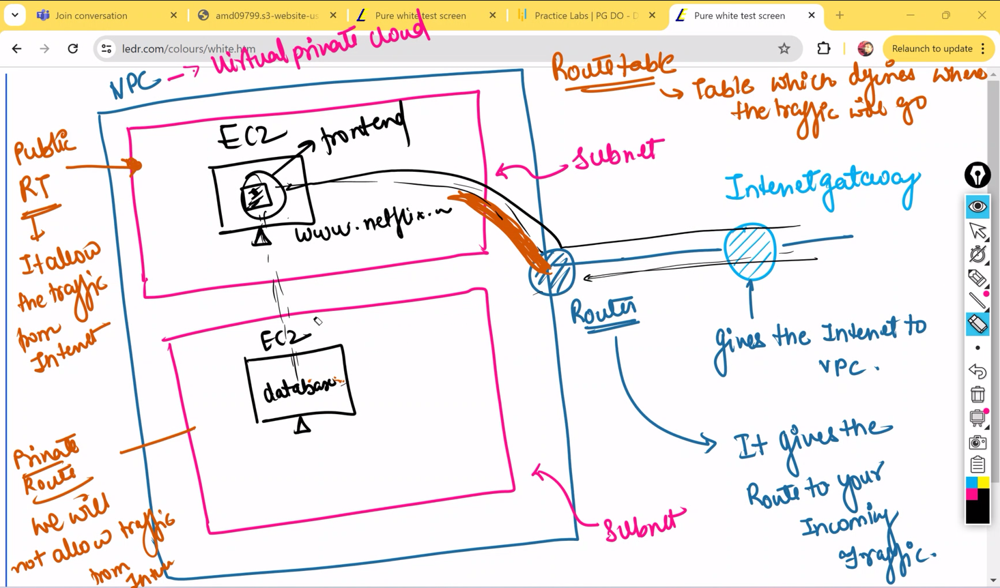
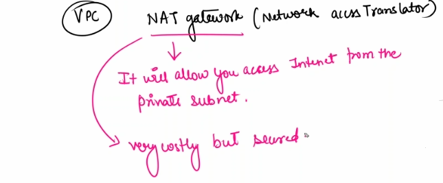

# Virtual Private Cloud (VPC)

It is the custom network with the resources

It is a network in which the resources are created 

### Type:
- Custom VPC
    - The custom network we create as per client need and requirment 
    - no connection to internet
- Default VPC
    - when you create on AWS you VPC have get 1 default VPC in every region 
    - resourses in default 

Network where in your resources is present

## Subnet
- VPC is divided into subnetworks
- sub network --> network within in the network

## Internet gateway

It gives the pathway to VPC to be accessable from internet

Gives internet to VPC

## Route table

It acts as a traffic manager in VPC. It is a table which defines where the trffic will be able to go

Private subnet - not connected to internet - generally keep databse here 

Public subnet - resources inside this subnet is connected to innternet 

Router - It gives the route to your incomming traffic

## Internet Protocol (IP)

CIDR -Classless Inter-Domain Routing

/16 - means we are giving 16 bits to the network- represents a network

/24 - represents a subnet

the remainingg digits represent the item in the subnet

## Import facts of VPC

1. In a specific region we have a max of 5 VPCs.
2. There is a firewall across the subnets. Which is called **Network Access control list (NACL)**
3. Two resources with two different VPC cannot communicate with each other  but we can establish a connection between the two VPC by VPC peering 

## NAT gateway (Network Access Translator)

It will allow you to access Internet from the private subnets 

- Very costly
- Very secure

