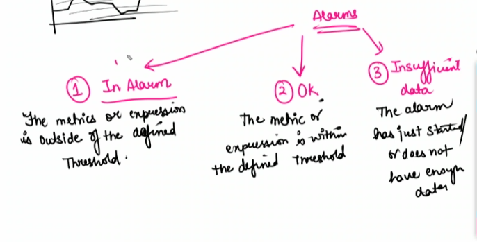

# Cloud Watch 
- Resource in AWS which monitors the AWS resources

Cloud watch monitors the AWS logs.

Create a Real tme dashboard from cloud watch

Create an alarm

### Alarm 
It will trigger when the CPU utilisation goes more than a value

Types:
1. In Alaram
     - The metics or expression is outside of the defined thershold
2. Ok
    - The metric/expression is whithin the defined threshold
3. Insufficent data
    - The alar just started or does not have enough data

