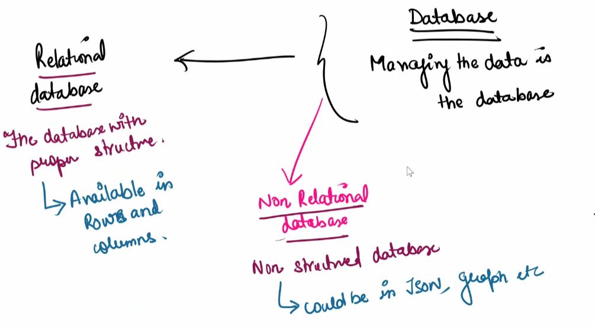
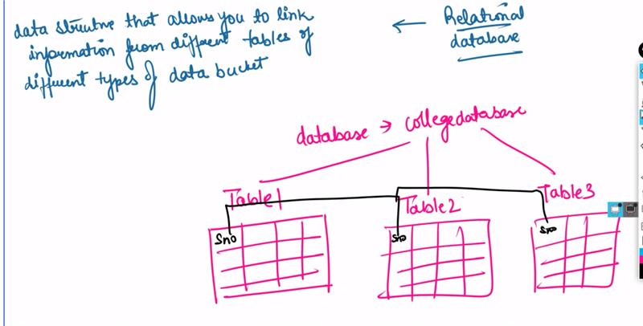

# Database

Managing the data in the database

- Relational database
    - the database with proper structure
    - avaliable as rows and columns
- Non Relational database
    - Non structured database
    - could be any structure(json, graph etc.)

## Relational database
data structure that allows you to link information from different tables of different types of data bucket
- structure of database is fixed - Schema is fixed
Examples of relational database :
- Mysql
- Oracle
- IBM 2b

They are structured

## Non- Relational database
STores the data without a structed mechanism to link data from different tables to one another
- low cost for hardware
- faster than relational databases.
- Schema not fixed

Examples:
- MangoDB
- Cassandra 
- Dynamo

### Standard create 
- most of the settings are managed by us
### Easy create
- most settings are decided by AWS

### Production 
- databse uptime should be more than 99.99%
- fast 
- consistence

### Dev/test
- fast but not ganteered uptime
### free teir
- some resourses will not b there

## Multi-AZ
Make sure it is avaliable in multiple avalibity zone to ensure that is one database is down another is available 

public access 
- if set as yes then from any network you have username and password. You will be able to connect
- No means - If you are in network of database then you will be able to connect

RDP 
