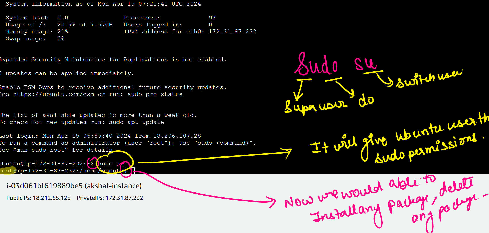
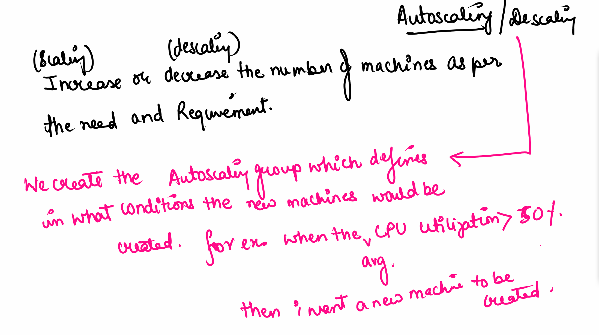
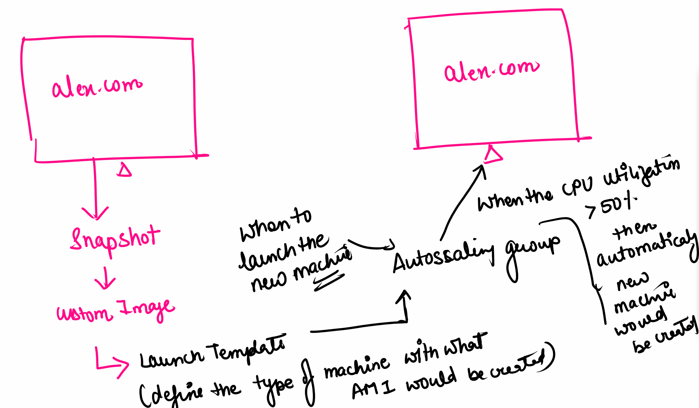
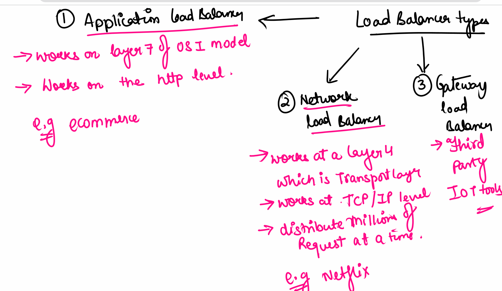

# Servers

## EC2 - Elastic Compute Cloud

Creating an instances(which are the servers) + storage to the server
Which is a complete machine which is running

### 1.Creating a Ubantu machine
- searching EC2 
- click EC2
- click instances to create a server
- click lanch instances ie. North Vagina
- Give name of the server -Anyname to the server - i.e. rashay-instance
-  Amazon Machine Image (AMI) - Operating system that you want avaliable
    - Default AMI ' ones that are default, macos, Amazon Linux, Ubantu
    - Custom AMI - convert machine from a ami and create a copies of it
    - free tier just the OS no server
- Architechture - bit i.e. 64bit
- AMI-ID is the operating system ID
- Instansce style - type of machine being launched, vCPU, RAM size - t2.micro
- Key pair - Key to access the machine - If lost you will loose access of machine
    - Private key will be downloaded in the laptop
    - another key will in the server
    - when trying to connect will validation with the key to connect to the server. Validation 
    - i.e my-key-123
        - RSA only
        - ED25519 - It only works on Ubantu based worked 
        -.pem formate only - can be oped as a notpad
- Networking - use default 
- firewall - select the ones below 
    - enable SSH (Secured Shell - allow to conect to AWS EC2 machine from diffrent networks)
    - HTTP - give internet conectvity  
    - HTTP5 traffic
- click launch instance 

Wait a few minites for the machine to buld and become live
- 8gb of storage will be 8gb by default

vCUPU - number of processes that my system can handle at a point of time

Firewall - limit the the traffic to access the machine. Will acces a specfic port to access the app and if you dont have access you will be stopped. Lie a security guard.

### 2.Instance states:
- Running - You have to pay for server and storage 
- STopped - it will reinstall where you left off and is in stopped state - you pay for storage not for the serverr
- Terminated - machine is deleted  - zero billables 

[Steps for setting up](https://drive.google.com/file/d/1RFhI22JODHMbxluI1UTcjp-c_-c5vwRv/view?usp=sharing)

## Type of Instance :
- On Demand - Whenever we need the instances we can ppay per miitue/hour basis
- Savaings plan - we do a comitmit for a certain duration on a spercific configuration - you get a discount
- Spot - Bid like ebay - you bid for the amount of instances on the discounted price as soon as you go above the amount you will be terminated - cheapest intance to purchase
- dedicated hosts -buy server with software with subscription installed in it 

[types of instances](https://drive.google.com/file/d/1RFhI22JODHMbxluI1UTcjp-c_-c5vwRv/view?usp=sharing)

### sudo su
- Super user do  switc user - It will give the Ubuantu user the sudo perissions - Now we will be able to install/delete any pagackage (admin privalge) 

- crtl +l - to clear the screen

### To make a server to a web server 
- installing we server application - like apache, domcat
1. Install apache: 
    - sudo su
    1.  apt update -y 
        - Advanced Package tool - If you want to install, delete, update anything in Ubantu Machine
        - It will update all packages
        - -y to keep all default settings while update 
    2. apt install apache2 -y
        - install -install something
        - apache2 - webserver
    3. cd /var/www/html
        - change directory
        - the dicrorty to move to   
    4. pwd
        - present working directory
    5. ls 
        - list all the files in the currecnt dicectory 
    6. rm index.html
        - remove index.html
    7. vi index.html
        - file editor - it will create file with name 
        - you will see a page in front of you
        - Press `i` button to start typing - moves to insert
        - Press esc + :wq + enter - this is to exit the file
    8. cat index.html
    - read file
    9. history 

### On Amazon Linux
- sudo su
- yum install httpd -y
- service httpd start 
- cd /var/www/html 
- rm index.html
- vi index.html 
    - press i to start inserting 
    - hello world
    - press esc :wq
- cat index.html 

Fix the problem when you terminate and restart the linux server is that it doesnt automatically start server 

The Fix:
- systemctl  enable httpd

## Elastic IP
prevents the ip address from changing - comes with some cost
1. click on elatic ip's
2. allocate elatic ip
3. actions and click assiate to assotiat with any machine
4. disassate it then dissove the connection to remove the elastic ip

[documents](https://drive.google.com/file/d/1rnEWBKD--RwpcUxI2_HiWIResj3DE23g/view?usp=sharing)

## Manual Backups (Snappshots)
 - Point in time back up of the machine 

 15 APr -> 100Gp -> snapchot(100GB)
 16 Apr --> 150GB -> snapshot(50GB)

Elastic Book store
- click snapshot
-
    - volume
    - Instance - full backup
    - add description

## Create machine from snapshot
1. First create snapshot of machine
2. from the snapshot we created the custom image
3. from custom image we create ec2 image
Create a new machine from snapchot - custom AMI 

Go to image and click create snapshot from image 

Root volume - is where os is installed 
virtualisation convert hardware to software

[documentation snapshot](https://drive.google.com/file/d/1UXEwyClMY8G-i1IjmgwAkdA7hNCh8Giw/view?usp=sharing)

## Autoscaling
Increaseing or descreasing the number of machines as per the lead.

more traffic -> number of machines should increase --> Autoscaling

less traffic -> number of machines should decrease --> descaling

We create a auto scaling group in what conditions the new machines will be created . E.g. When the CPU utilisation gooes more than 50%. Thenn you will add a new machine to be created.

To do tis you create a snapchot --> custom image --> launch templates (define the type of machine with what I would create) --> create autoscaling group (if cpu is more than 50% then automatically new machine will be created)

Craete a launch template under instances:
1. create launch template click
    - give name e.g. akshat-template
    - click my AMIs 
2. when to launch new machine - Autoscaling group
    - give name e.g. launch-autoscaling 

Loadbalinging - 3 types

Scaling 
- minimun desired level
- max desigred desired level

Autoscaling in what senarious when it should be scaling
no scaling policies - wont upgrade
tracking opertions when your cPU or others go above a certain percentage add another machine
Only configure one metric 

### Simple notification service
- we can send a notification mail or sms in case the new machine is created or removed - lives in sns

[Auto scaling notes](https://drive.google.com/file/d/1xczXRbspXKYUx1APtJW-SW03pa-dC5mL/view?usp=sharing)

## Load balancer
Balences the load between the machines 

performance issues when one server is running at max

Types:
1. Application
    - works on the 7th layer of OSI model
    - works on the Http level
    - e.g Ecommece    
2. Network balancer
    - works at layer 4 which is transport layer
    - works at TCP/IP levle
    - Distributes millions of requests at a time
    - e.g Netflix
3. Gateway load balancer
    - Third party IOT tools

loadbalencer does health checks on the pcs and checks on the machines so that it wont send things to machines with 

### Application load balancer 

## Network Loadbalancer
No thinking can cater for millions of requests 

Sercuirty group must be the same as the machines security group

[Note balancing lab](https://drive.google.com/file/d/1-18poyZl3RlMBPIP7qcmbfeMpJ8JPPQ0/view?usp=sharing)

